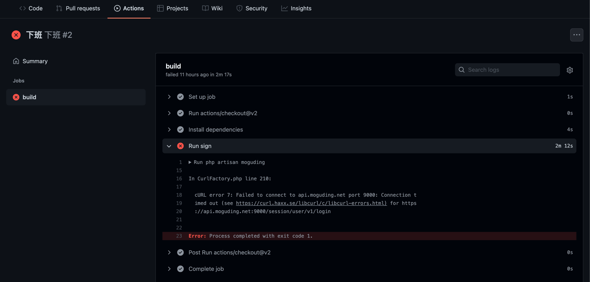
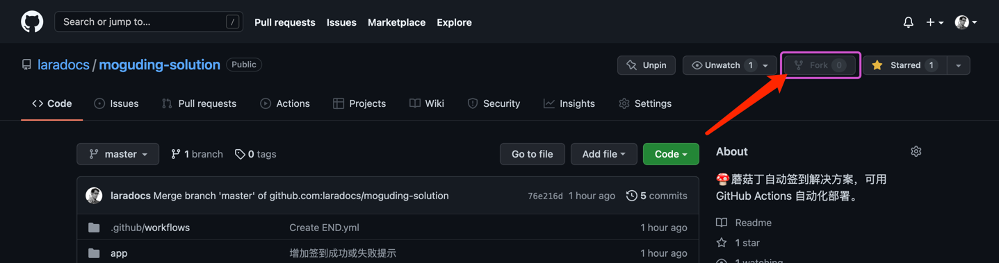
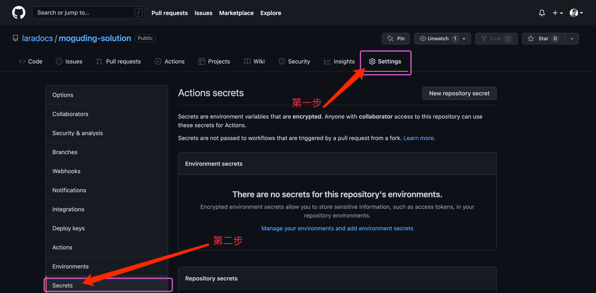
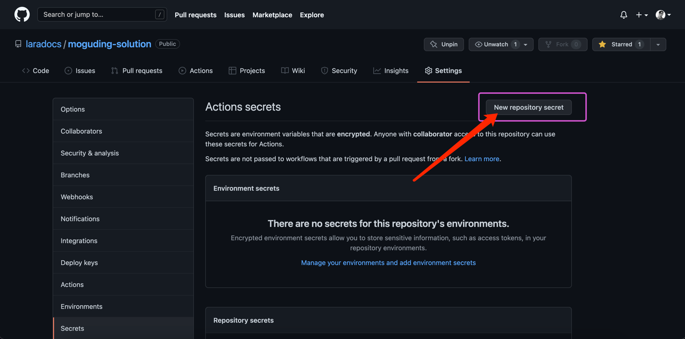
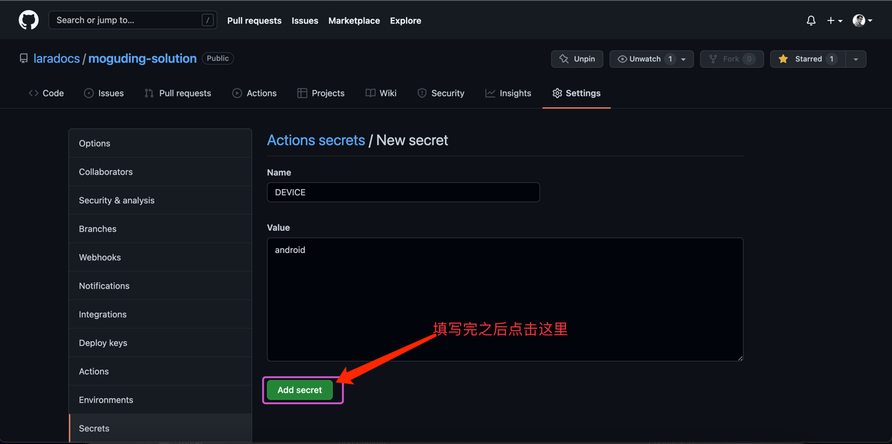
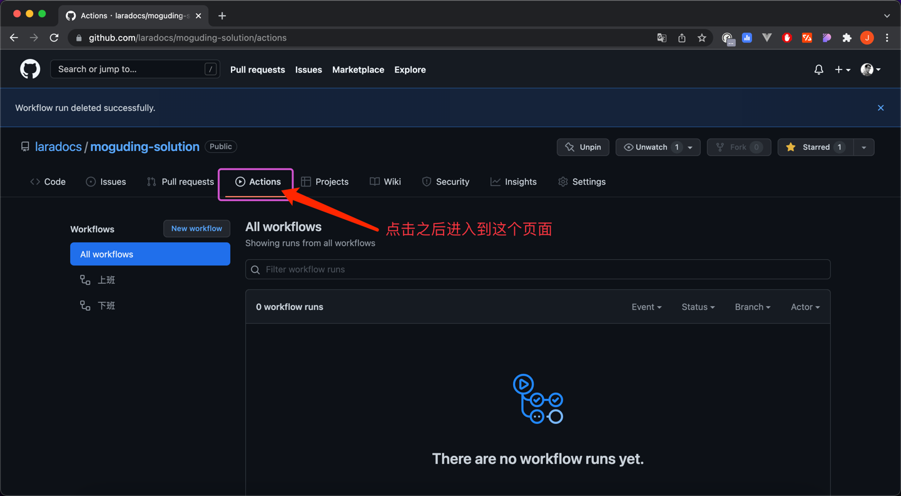
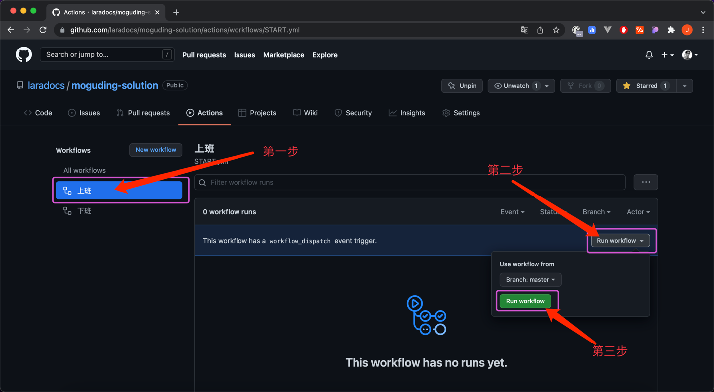
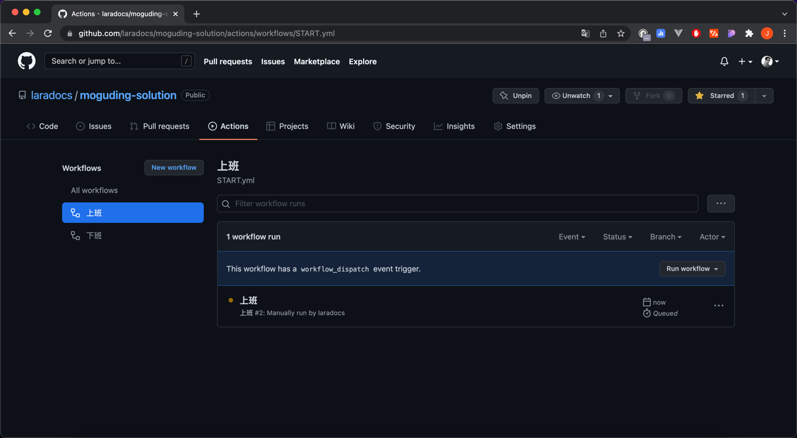
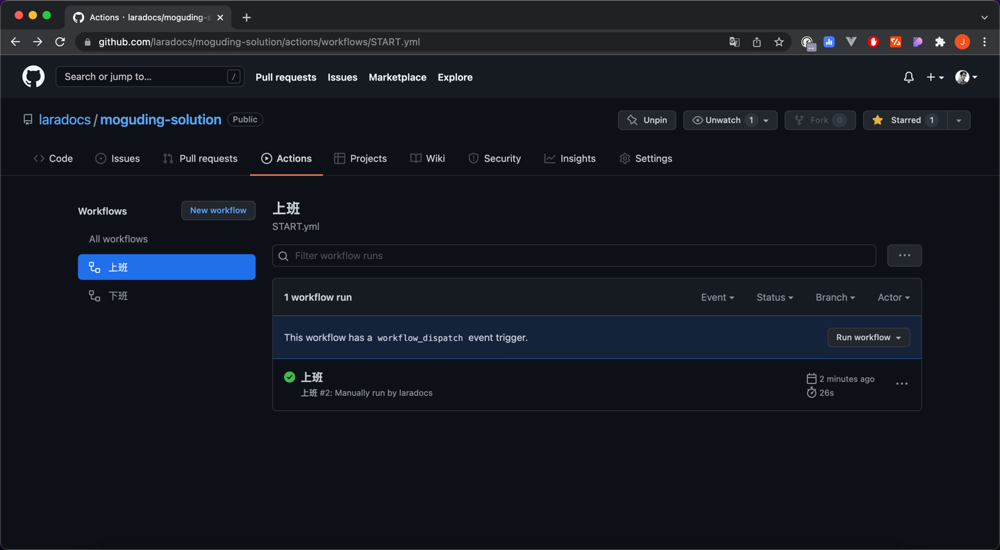
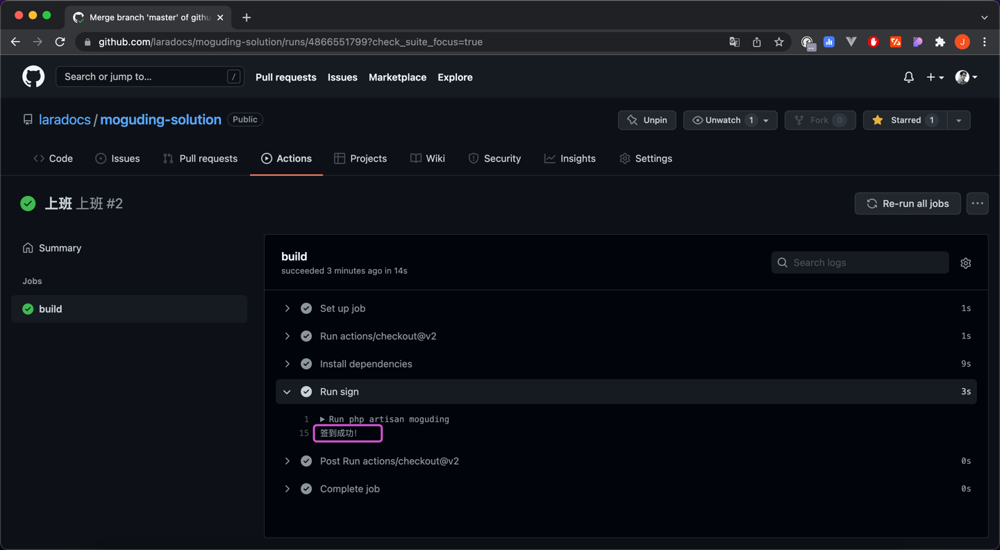

# 🍄蘑菇丁自动签到解决方案

    

<h1 align="center">蘑菇丁自动签到</h1>

## 功能

到点 `上班` 和 `下班` 自动签到

上班签到时间 `8:30`
下班签到时间 `17:30`

如需修改时间

请修改 `.github/workflows` 文件夹中的 `START.yml` 文件 和 `END.yml` 文件

`START.yml` 文件执行的是上班

`END.yml` 文件执行的是下班

> 注：使用的是 UTC 时间。  

> 建议最好还是不要修改，除非你能解决代码冲突问题。  
> 否则如果我更新了代码会给你带来一定的麻烦。

## 依赖

- [php-moguding-sdk](https://github.com/laradocs/php-moguding-sdk)

## 常见问题

1. Error: Process completed with exit code 1.

如果出现了上面的字样，那么就把当前的 `workflow` 删除重新执行。

暂时还没找到具体问题出在哪里。有可能是 `上网` 的问题(猜测)。

## 用法

1. Fork 项目

点击右上角的 Fork 按钮

项目将会到你的仓库

2. 添加 Secrets

点击 `Settings` 按钮

然后再点击 `Secrets` 按钮

3. 添加参数

点击 `New repository secret` 按钮添加参数

需要添加以下参数：

- DEVICE: android|ios
- PHONE: 手机号码
- PASSWORD: 密码
- PROVINCE: 省(一定要写全，例如：江西省)
- CITY: 市(一定要写全，例如：南昌市)
- ADDRESS: 详细地址(可以登录蘑菇丁查看定位，把省和市去掉)
- LONGITUDE: 经度
- LATITUDE: 纬度

如果你不知道经纬度

可以打开这个网站：[经纬度查询 - 坐标拾取系统](https://jingweidu.bmcx.com)

填写所在的 市(例如：南昌（不要带上后面的市）)，然后点击 查询 就好了。

填写完成后点击 `Add secret` 按钮即可。

然后接着往下添加。

5. 启用 Actions

点击 `Actions` 按钮后默认会看见 `上班` 和 `下班`

然后点击 `上班` 或 `下班`

接着点击 `Run workflow(黑色)`

然后再点击 `Run workflow(蓝色)`

最后喝杯咖啡等待一下，直到棕色的点变成绿色

当然，还可以点击 `上班`，然后再 `build` 查看详情

同理，下班也是这么操作。

如果有疑问或问题，可以在 [issues](https://github.com/laradocs/moguding-solution/issues) 中提出。
